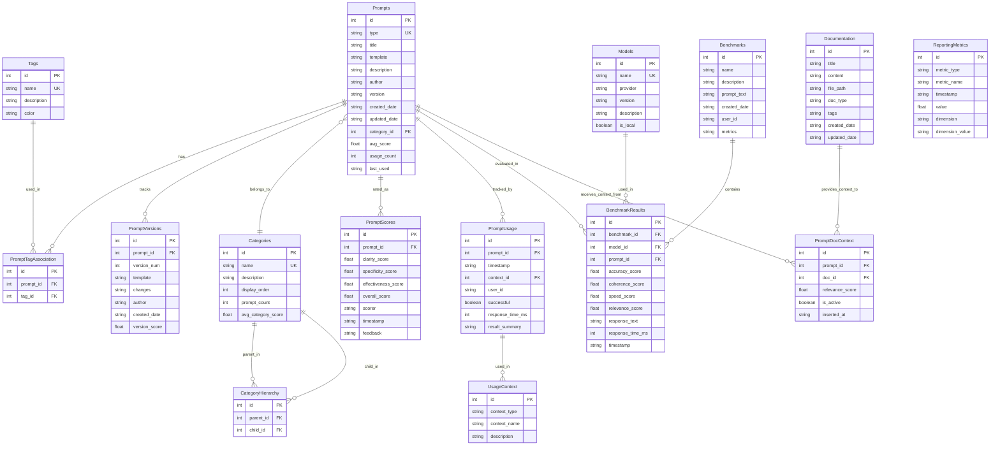

# Prometheus AI Database Schema Diagram

## Entity Relationship Diagram (Mermaid Format)

## Notes on Database Schema

This diagram represents the complete database schema for the Prometheus AI Prompt Generator application. The schema includes:

1. **Core Entities:**
   - `Prompts`: Stores prompt templates with unique identifiers
   - `Tags`: Categorization labels for prompts
   - `Categories`: Hierarchical organization for prompts

2. **Relationships:**
   - Many-to-many between Prompts and Tags (via PromptTagAssociation)
   - One-to-many between Categories and Prompts
   - Self-referential relationship in Categories for hierarchical structure

3. **Versioning and History:**
   - `PromptVersions`: Tracks historical versions of prompts
   - `PromptUsage`: Records when and how prompts are used

4. **Analytics:**
   - `PromptScores`: Quality metrics for prompts
   - `ReportingMetrics`: Denormalized metrics for efficient reporting

5. **Benchmarking:**
   - `Models`: Registry of available LLMs
   - `Benchmarks`: Test definitions
   - `BenchmarkResults`: Performance metrics

6. **Documentation:**
   - `Documentation`: Stores context documents
   - `PromptDocContext`: Maps relevance between prompts and documentation

The schema is designed to support all requirements of the Prometheus AI application with a focus on performance, scalability, and analytical capabilities. 